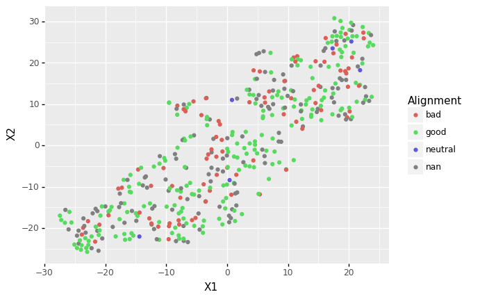

```{r setup, include=FALSE}
knitr::opts_chunk$set(echo = TRUE)
```


```{r, include = FALSE}
library(tidyverse)
library(gbm)
library(caret)
library(e1071)
```

# Question 1 : Redo GBM Model on New Data Set

First the data needs to be loaded.
```{r}
weight_height = read.csv("weight-height.csv")
```

Next, we will choose 70% of the data to be used for training the model, 15% of the data for validating the model and tuning the parameters, and 15% of the data for testing the model. Upon inspection, the data is arranged first all males, then all females, so first the order of the rows in the data set will be randomized, then we will assign the first 7000 entries to the training data set, the next 1500 entries to the validation data set, and the last 1500 entries to the testing data set. 

```{r}
## Randomize order of rows in the dataset
weight_height = weight_height[sample(nrow(weight_height), nrow(weight_height)),]

## Assign to Training, Validation, and Test set
set = c(rep("Train", 7000), rep("Validate", 1500), rep ("Test", 1500))
weight_height = weight_height %>% mutate(set = set)
```

Next, we need to transform the gender variable into a set of 0's and 1's, so that we can use it in our model. Thus, female will take on the value of 1, and male will take on the value of female

```{r}
female = weight_height$Gender == "Female"
weight_height = weight_height %>% mutate(female = female)
```


Now we are ready to create our GBM model. The summary of the model is displayed below

```{r}
model.gbm <- gbm(female ~ Height + Weight,
                 weight_height %>% filter(set == "Train"),
                 n.trees = 100,
                 interaction.depth = 2,
                 shrinkage=0.1, distribution = "bernoulli")
summary(model.gbm)
```

In order to test the accuracy of our model, we first need to apply our model to the non-training data. Since we do not do any model selection, since the rest of the assignment uses a different data set, we will test the data on both the validating and testing data set. 

```{r, results = 'hide'}
test <- weight_height %>% filter(set != "Train");
test$female.p1 <- predict(model.gbm, test, type="response")
```
The accuracy of the model is displayed below. (It is the value on the left). This is compared to the accuracy simplest model possible, which guesses male for all of the data (this is the value on the right.

```{r}
gbm.accur = c(sum((test$female.p1>0.5)==test$female)/nrow(test),
              sum(FALSE==test$female)/nrow(test))
data.frame("GBM_Accuracy" = gbm.accur[1], "Simplest_Model_Accuracy" = gbm.accur[2])
```

Our GBM model has a much higher accuracy than the the simplest model that always guesses male. Additionally, it has a much higher accuracy than the GBM model made in the previous homework assignment which had an accuracy of about 52%. It is not surprising that this new GBM model has a much higher accuracy because it was used on a data set of real people with real genders, heights, and weights as opposed to those that were randomly generated. Therefore, in this data set the label of female and male had a correlation with the height and weight provided, while the old data set did not. That is why this model is able to predict the gender based on the height and weight with a much higher accuracy than that in the previous homework could. 

\pagebreak

# Question 2

&nbsp;

### 1. Examine the dataset for any irregularities. Make the case for filtering out a subset of rows (or for not doing so).

First the data needs to be loaded.
```{r}
character_stats = read.csv("charcters_stats.csv")
```

Upon examination, it appears that there is a set of data for which the "Total" column is 5. All of these characters have an intelligence, strength, speed, durability, and combat score of 1, and a power score of 0. Not only do all of the other characters have values much higher than that, but these traits would not make one a superhero, so they should not be on the list. Therefore, all of these observations will be filtered out. 

```{r}
character_stats = character_stats %>% filter(Total != 5)
```

&nbsp;

### 2. Perform a principal component analysis on the numerical columns of this data. How many components do we need to get 85% of the variation in the data set?

```{r}
pca = prcomp(character_stats %>% select(c(Intelligence, Strength, Speed,
                                          Durability, Power, Combat, Total)))
summary(pca)
```

Only one component is needed to get 85% of the variation in this data set. However, when the data is normalized (see the next question), four principal components are necessary to capture 85% of the variation in the data set.

&nbsp;

### 3. Do we need to normalize these columns or not?

Yes, the columns do need to be normalized when PCA is performed. Below, the data is first normalized, then a principal component analysis is performed on the data. 

```{r}
scaled_data = as.data.frame(scale(character_stats%>% select(c(Intelligence, 
                                                              Strength, Speed, 
                                                              Durability, Power,
                                                              Combat, Total))))
pca1 = prcomp(scaled_data)
summary(pca1)
```
With the normalized data, four principal components are needed to get 85% of the variation in this data set.

&nbsp;

### 4. Is the “total” column really the total of the values in the other columns?

```{r}
x = character_stats[,3] +  character_stats[,4] + character_stats[,5] + 
  character_stats[,6] + character_stats[,7] + character_stats[,8] 
character_stats$Total - x
```

Since the difference between the "Total" column and the sum of the values of the other columns is 0 for all entries, therefore, yes the "Total" column is really the total of the values in the other columns.

&nbsp;

## 5. Should we have included it in the PCA? What do you expect about the largest principal components and the total column? Remember, a given principal component corresponds to a weighted combination of the original variables.

No, we should not have included it in the PCA. This is because a given principal component corresponds to a weighted combination of the original variables and since the total is a combination of the other variables, therefore the variables are over counted. Since after the data is normalized, the total is no longer a sum of the other columns, this is why the PCA gave such different results after normalization. I believe that in the original non normalized pca, the largest principal component consists primarily of the "Total" column as it is already a linear combination of the other columns. 

&nbsp;

### 6. Make a plot of the two largest components. Any insights?
```{r}
x = pca$rotation[1,1]*character_stats$Intelligence + 
  pca$rotation[2,1]*character_stats$Strength + pca$rotation[3,1]*character_stats$Speed +
  pca$rotation[4,1]*character_stats$Durability + pca$rotation[5,1]*character_stats$Power +
  pca$rotation[6,1]*character_stats$Combat + pca$rotation[7,1]*character_stats$Total

y = pca$rotation[1,2]*character_stats$Intelligence + 
  pca$rotation[2,2]*character_stats$Strength + pca$rotation[3,2]*character_stats$Speed +
  pca$rotation[4,2]*character_stats$Durability + pca$rotation[5,2]*character_stats$Power +
  pca$rotation[6,2]*character_stats$Combat + pca$rotation[7,2]*character_stats$Total

character_stats = character_stats %>% mutate(x = x, y = y)

ggplot(character_stats, aes(x=x, y = y))+geom_point(aes(color = Alignment))+ 
  labs(x = "Principal Component 1", y = "Principal Component 2", 
       title = "Plot of the Two Largest Components")+ theme_classic()
```

The data seems to be fairly evenly spread out with no very clear trend, however it appears that there are more "good" characters with less negative values of principal component 2, than there are "bad" characters. 

\pagebreak

# Question 3: Use Python/sklearn to perform a TSNE dimensionality reduction (to two dimensions) on the numerical columns from the set above.  In R, plot the results. Color each point by the alignment of the associated character. Any insights?

&nbsp;

The TSNE dimensionality reduction was done in a jupyter notebook. To see the code used, please open the "Homework 5 Question 3 and 4.ipyr" file in the "Homework 5" folder. 

Now that data will be loaded. 
```{r}
TSNE = read.csv("TSNE_data.csv")
```

Next, it will be plotted against
```{r}
ggplot(TSNE, aes(x=X1, y =X2))+geom_point(aes(color = Alignment))+
  labs(title = "TSNE Dimension Reduction Plot")
```

There is a very strong linear relationship between the two dimensions. However, the data is very well spread out by alignment, so there is no clear trend between the alignment and the dimension reduced data.

\pagebreak

# Question 4: Reproduce your plot in Python with plotnine (or the library of your choice).

&nbsp;

The plot was made in the Jupyter notebook, but is pasted below for ease of access. To see the code used, please open the "Homework 5 Question 3 and 4.ipyr" file in the "Homework 5" folder. 


The figure looks exactly the same as that plotted with ggplot in R.

\pagebreak

# Question 5: Using the Caret library, train a GBM model which attempts to predict character alignment. What are the final parameters that caret determines are best for the model.
&nbsp;
First we need to create a data set
```{r}
trainIndex <- createDataPartition(character_stats$Alignment, p = .8, 
                                  list = FALSE, 
                                  times = 1)
```

Now we need to create the model. Again, Total will not be used as it is a linear combination of the other column values.

```{r}
form <- Alignment ~ Intelligence +  Strength +  Speed + Durability + Power + Combat
```

Now we will use Caret ot create the gradient boosting model

```{r}

train_ctrl <- trainControl(method = "repeatedcv", number = 50);
gbmFit1 <- train(form, data = character_stats %>% slice(trainIndex), 
                 method = "gbm", 
                 trControl = train_ctrl,
                 verbose = FALSE)
summary(gbmFit1)

```

Caret determined that the two parameters that are best for determining the alignment are intelligence and combat. 

\pagebreak

# Question 6: A conceptual question: why do we need to characterize our models using strategies like k-fold cross validation? Why can’t we just report a single number for the accuracy of our model?

&nbsp;

This is because since you set aside some data for validation and some data for creating the model, depending on what that partition is, you will get a slightly different model with a sightly different accuracy every time. This is why it is not possible to report a single number for the accuracy of our model. Thus, in order to truly get a sense of how accurate the model is, and to characterize it, we need to recreate the model on many different possible partitions of the data, which is why k-fold cross validation is used to characterize our models. 

&nbsp;

# Question 7: Describe in words the process of recursive feature elimination.

&nbsp;

Recursive feature elimination helps you determine which pieces of your data should be used as predictors for a model. How it works is that a model is made, and this model determines which feature is least important as a predictor and the model is characterized. Then, a new model is made without that least important feature, and that model is characterized. A new least important feature is determined, and then another model is made without both least important features. This is repeated over and over again, until either a certain performance profile of the model is achieved or only a specified numbers is left in the model. 


