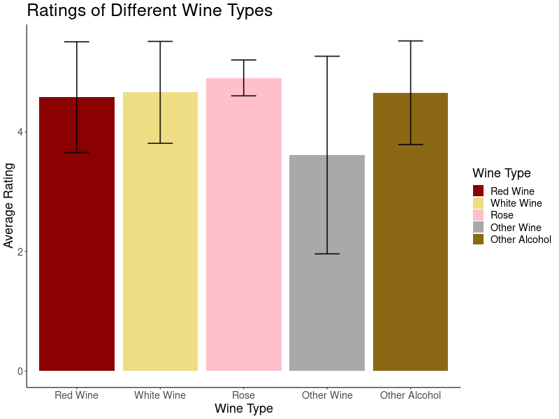
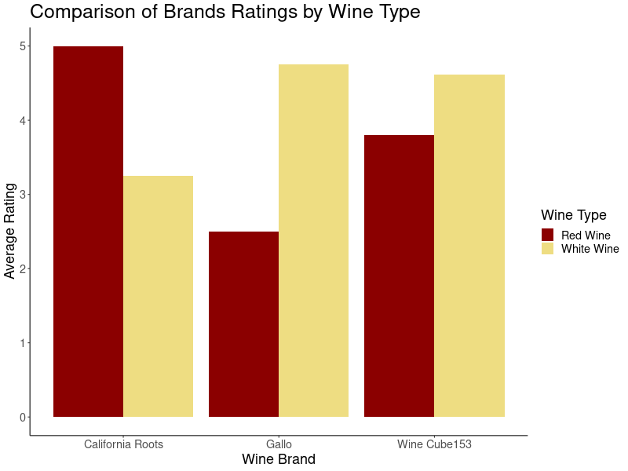

Bios 611 Project
================

Dataset of Reviews and Qualities of Wine and Other Alcoholic Beverages
-----------------------------------------

Usage
-------

You'll need Docker and the ability to run Docker as your current user.

You'll need to build the container:

     > docker build . -t project1-env

This Docker container is based on rocker/verse. To run rstudio server run:

    > docker run -v `pwd`:/home/rstudio -p 8787:8787\
        -e PASSWORD="Your Password Here" -t project1-env
        
Then connect to the machine on port 8787

In order to build the final result, enter with Rstudio and say:

     > make Report.pdf 

In order to run the interactive R Shiny Component of this project, run:

    > docker run -p 8081:8081 -v `pwd`:/home/rstudio \
        -it project1-env sudo -H -u rstudio /bin/bash -c \
        "cd ~/; PORT=8081 make wine_rec"

Then connect to the machine on port 8081

Project Proposal
-------------------

### Introduction

Growing up in a household of oenophiles, I always assumed I would grow up with a vast knowledge of wines. After all, my parents have imported cases of wine from Georgia (the country, not the state) and our annual trip to see family friends in Sonoma consisted of visiting at least two wineries every day. There was one slight miscalculation to my plan, the majority of the wine tours occurred when I was between the ages of ten and eighteen (below the legal drinking age). Since I was not allowed to attend any tastings, I missed a lot of the crucial information and am now significantly less knowledgeable about brands and types of wine than I would like to be. Unfortunately, the budget of a graduate student and a pandemic has made it difficult to tour wine country and discover novel wine types or buy many different brands and types of wine to discover my taste (two buck chuck has a fairly small selection of wine types), thus I have decided that the next best thing is to analyze data of reviews of wines found online to determine what the best brand and wine type is for my particular taste. 

This project will examine the effect that various key words in reviews (eg. sweet, fruity, smooth) have on the rating of the wine. compute descriptive statistics of various wines by examining their ratings, reviews, and chemical composition. I will also attempt to use the key words in flavors of reviews (eg. sweet, fruity, bold) to develop a function that can predict the best wine (type and brand) based on one's current wine craving. I additionally will create a gradient boosting model in order to determine which of the chemical components have the greatest effect on the quality of the wine. Then, this component will be analyzed to determine what effect this component has on the quality of the wine. This will help me determine what is most important in making a good wine, on a fundamental level. 

## Datasets

The datasets I undertake to analyze are publicly available on data.world and cover the chemical composition and reviews of wine and other alcohols. They can be downloaded.

This repo will eventually contain an analysis of reviews and qualities of wine and other alcoholic beverages.

## Preliminary figures

The above figure shows a comparison of the average rating of wines by their type. Error bars represent the standard deviation in ratings. It is evident that rose wine has the best reviews out of all the wine types. 

When the top three most popular brands that have both red and white wine reviews are compared, it is evident that the type of wine has a large influence on the rating that brand receives.  

R Shiny Portion
-----------------

The interactive R Shiny Component of this project is a function that accepts two words as input and determines what is the best wine with both of those characteristics based on the obtained reviews. One of the words is a description of the wine (sweet, price, smooth, dry, light, fruit, cheap, flavorful, or affordable) and the other word is a type of wine (red, white, rose, other wine, or display for all types of wine). Additionally, for the two words chosen, the shiny app creates a graph that displays the average rating given to wines whose reviews include both of those words with error bars that represent the standard deviation. The code for the app can be found in the Project_2 folder. 

Makefile
-------

The Makefile is an excellent place to look to get a feel for the project.

To build figures relating to the ratings of wines, for example, enter with Rstudio and say:

     > make prelimfig/wineratingbytype.png 
     
Troubleshooting
---------------   
     
Sometimes there are issues with the rstudio image. If this is the case run the following code:

     > rm -rf .cache
     > rm -rf .local
     > rm -rf .rstudio/

