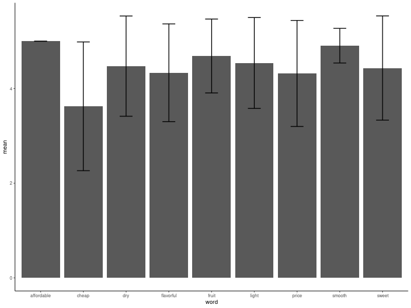

```{r setup, include=FALSE}
knitr::opts_chunk$set(echo = TRUE)
```

# Introduction

One of the most important things that can make or break a nice evening is whether you actually enjoy the wine you are sipping. I have began to notice that my strategy of choosing a wine simply because it has the prettiest label has begun backfiring as although the appearance of the bottle is phenomenal, the taste of the wine itself, most often is not. This has caused me to end up buying the same type of wine over and over again because I know that I will be satisfied with the taste. However, similarly to how one should not eat the same meal for dinner every single night for the rest of their lives, one should also not drink the same wine for the rest of their lives. This is why I decided to employ data science to aid me in my quest to discover new wines that I enjoy, as I cannot afford to taste test every single wine at Harris Teeter and Trader Joe's.

The datasets I undertake to analyze are publicly available on data.world and have been posted under source_data for convenience. Two of the data sets ([447_1.csv and wine_reviews.csv](https://data.world/datafiniti/wine-beer-and-liquor-reviews)) consist solely of the reviews of wines and other alcohol. These data sets contains information on the wine brand, the wine name, a rating of the wine, whether the reviewer would recommend this wine, and a review of the wine. They also use other miscellaneous information such as review date, manufacturing number, reviewer's username, and the url at which the review was found, which has not been included in the analysis of the data set yet. The other two data sets ([winequality-red.csv and winequality-white.csv](https://data.world/food/wine-quality)) contain information on the chemical composition and quality of the wine. These data sets contain information about the alcohol content, the acidity, the amount of sulfur dioxide, the amount of sulphates, the pH, the density, and much more. These data sets will be used in tandem to determine the best wine, in this case, by chemical composition. I will use these data sets to determine what the best wine is by taste and learn about how different components of the composition affect the quality of a wine. 

# Analysis

The first thing that was done was the reviews were filtered to find the most commonly used words. From here, only words that showed up in more than 25 reviews were included. Nine of the most practical words were chosen and used for further analysis (affordable, cheap, dry, flavorful, fruit, light, price, smooth, and sweet). This had to be done by hand because most of the words were along the lines of "wine", "red", "great", "tasty", and gave very little information about the characteristics of the flavor of wine itself. The average review and standard deviation of the review was calculated for each word and is displayed below.


It is very interesting to note that although affordable, cheap, and price, all refer to the same thing, the average review of the wine changes significantly based on which word was used. This is not too surprising as cheap has a more negative connotation than affordable, however this trend is still important to note as it demonstrates some of the bias in the reviews. By the graph, it is evident that "affordable" and "smooth" wines are the most highly rated, however "sweet" wines (my personal favorite) have a much lower average rating. 

As the main purpose of this data analysis was to determine what the best wine for my tastes is, I developed a function called bestwineforme that accepts up to two words as input from those listed above, and determines what is the best wine with bothof those characteristics based on the obtained reviews. 

```{r, include = FALSE}
source("functions.R")
```
An example of the function is displayed below. 

```{r}
bestwineforme("sweet", "fruit")
bestwineforme("cheap", "fruit")
```

Therefore, since my preferred wine is sweet and fruity, I should try Martini Rossi's Asti Spumante Sparkling wine and since my roommate's preferred wine is cheap and fruity, she should try Carnivor's Cabernet Sauvignon. However, it is important to note that this data set is flawed as it does not contain all of the possible combinations of flavors. For example, if one wants a wine that is cheap and smooth, the function does not return an output and simply says that there were no reviews found that included this combination of words.

```{r}
bestwineforme("cheap", "smooth")
```

Next, it is important to understand how reliable these reviews are. For example, how does a review of a 4 vs a 5 really compare? To do this, the proportion of reviewers that would recommend a wine for each possible rating was calculated. A graph depicting this is displayed below. It is very interesting to note that all of the wines with a rating of 4, the reviewers would recommend the wine, but the proportion of reviewers that recommend the wine drops (albeit slightly) when the rating is a 5. Additionally, it appears as though ratings of 1 and 2 are equivalent and ratings of 4 and 5 are practically equivalent. The rating of a 3, which is the midpoint of possible ratings, has a proportion recommend that is greater than 0.5. This is important to know in order to help us understand what a rating of 3 means. 


The next step in this analysis was to look into the compositions of wines. I trained two gradient boosting machine models on the winequality-red and winequality-white data sets. These examined the effect that pH, alcohol content, residual sugar levels, fixed acidity levels, volatile acidity levels, and free sulfur dioxide content had on wine quality. The relative influence of each component on the quality of wine was determined for each wine type. The results are displayed below. 


It is interesting to note that alcohol percentage has the largest influence on the quality of the wine. Since red wines have a tendency to be more dry and more flavorful, it makes sense that volatile acidity (something that contributes to smell) is a bigger influence on the quality of red wine than white.


Since alcohol is the largest relative influence for both, it would be interesting to see exactly how the alcohol content affects the quality. For each quality rating, the average alcohol content was calculated for both red wines and white wines and is displayed below. 


It is interesting to not that alcohol content increases as the quality of the wine does, however to increase quality from 4 - 5, there is a drop in alcohol content. Further analysis needs to be done to determine if there is a similar trend with the other components. 

# Future Analysis

An issue with the data set containing the reviews is that there were very many NA's and it was fairly small. Therefore, a good next step would be finding more data containing reviews of wines off other websites and analyzing those to see if they provide similar recommendations. 

Another next step is to add another function that would be able to predict the best wine for your taste, but you can specify the type of wine you want (eg you input one word such as sweet and a wine type such as red). Additionally, the quality ratings in the data set containing the chemical composition of wine has not been compared to the review ratings in the data set containing reviews of wine. These two data sets need to be compared in order to determine if the quality of the wine does improve its rating by an average consumer. 

The linear models trained on the chemical composition data set was used to determine the relative influence, but the efficacy of these models has not been determined. A good next step would be to test the model and determine if there are any more sophisticated types of models that would predict the quality of wine but its chemical composition with greater accuracy.

Lastly, since a function was developed to predict the best type of wine by somebodies taste, the next step is to test how well this function works by tasting the wine recommended. This function is already in the process of being validated as I have already ordered a bottle of Martini Rossi's Asti Spumante Sparkling Wine to try.